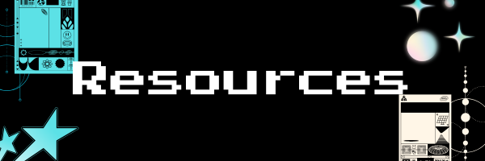

# reshi-the-coolram

Hello! It's <b>Reshi</b> and if you're reading this: <b>welcome to my website!</b>

In here, you'll learn all about me, my works, and other stuff like game updates and such. Basically a portfolio.

Ok so how does this website work?
click on this link:

Time to show you around!

On the main menu, you'll see three buttons:

<h1>> About me:</h1> 
    A section where you'll learn all about me, my hobbies, and what's in my inventory!

<h1>> Projects:</h1>
This is where you'll see all my projects (past, present, and future--- yes, future).

<h1>> Updates:</h1>
Stay up to date about my projects.

<b>Wanna go to other sections? click the "Back to Top" button.</b>

>Websites that helped me the most with code:

<a href= "https://www.w3schools.com/css/">w3schools css</a>

<a href= "https://www.w3schools.com/html/">w3schools html</a>

<a href= "https://www.youtube.com/watch?v=HD13eq_Pmp8"> Learn HTML in an hour by Bro Code</a>

>Websites that helped me with design

<a href= "canva.com">Canva</a>

<a href= "https://scripted.neocities.org/scrollbox">Neocities Scrollbox</a>

<a href= "https://codepen.io/Liton-Kumar-Dey/pen/VYvjqMm?anon=true&view=pen>">Minecraft font</a>

<a href= "giphy.com">Giphy.com</a>

<a href= "https://www.mf2fm.com/rv/dhtmltinkerbell.php">mouse effect</a>

Thank you for all your support! See ya!!!

